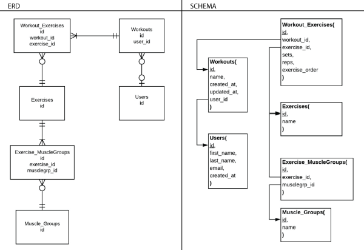
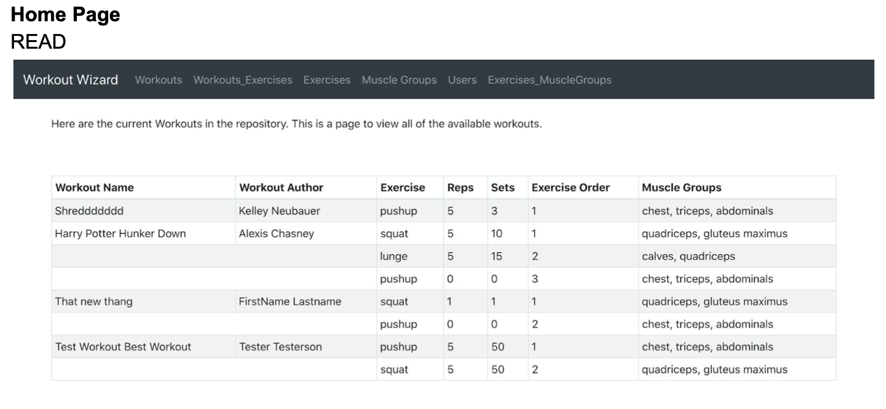
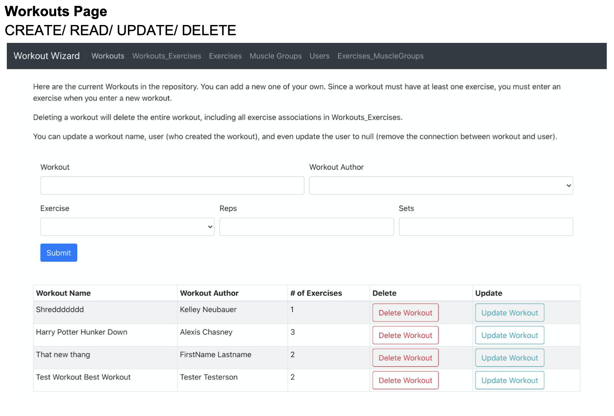
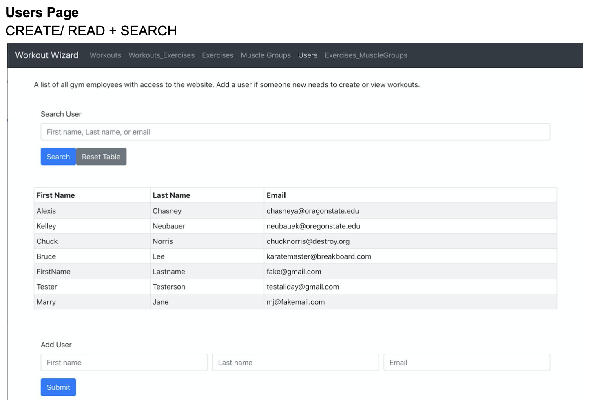
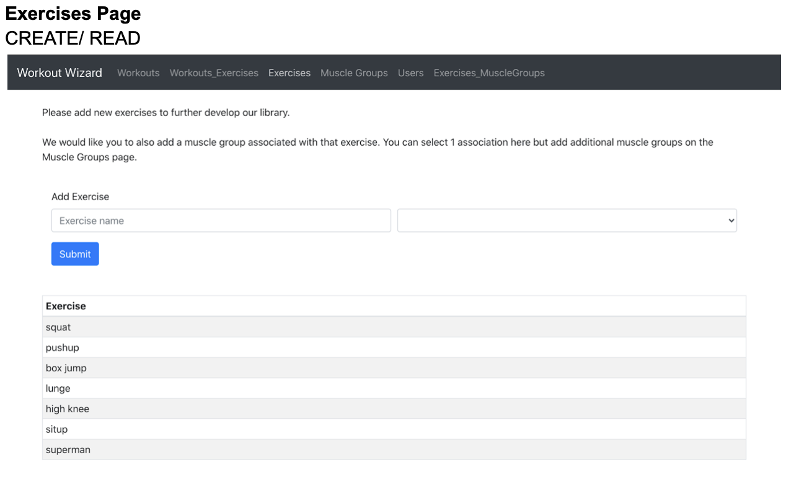
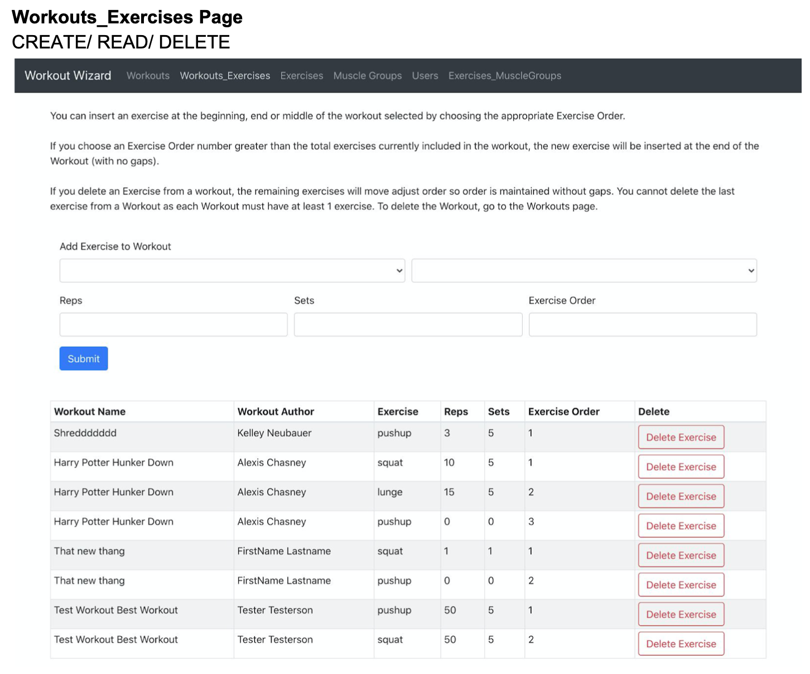
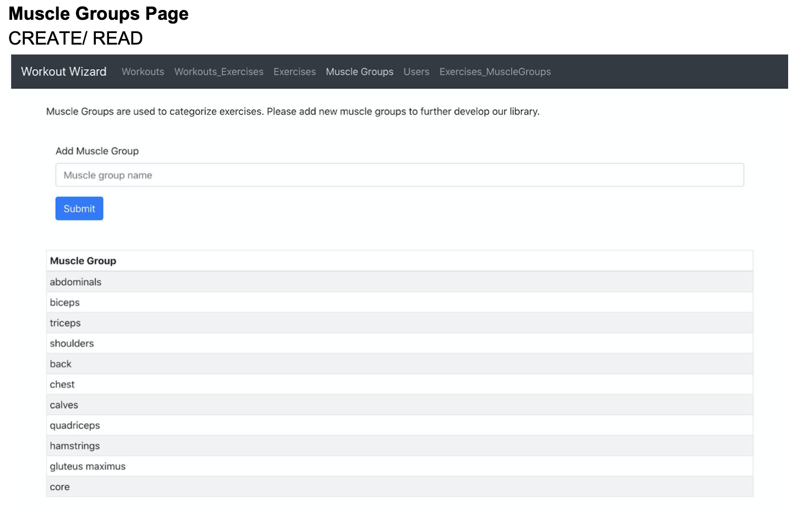
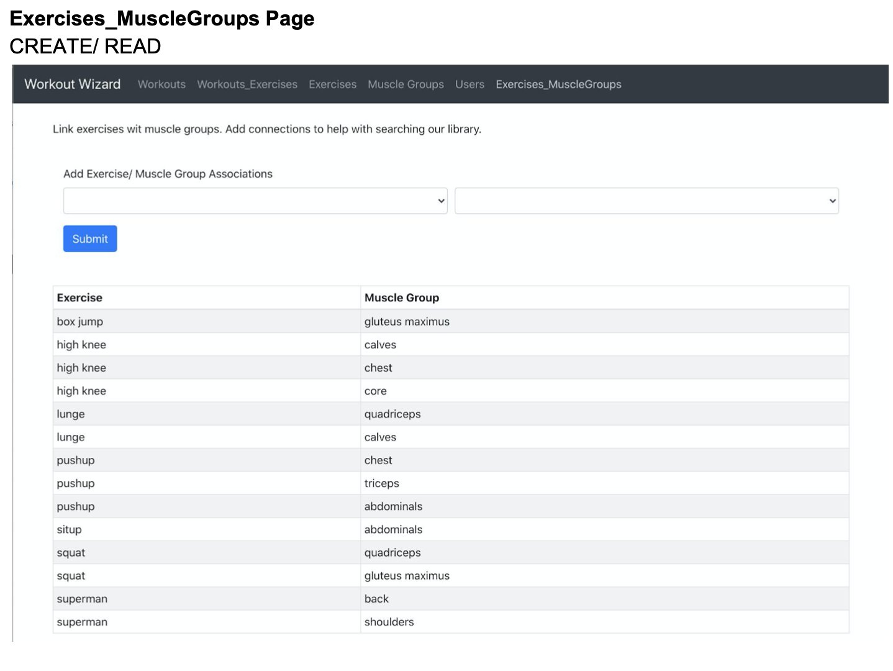

# WorkoutWizard

This is a React/Node.js web application designed to help gyms collect and maintain a repository of workouts for use during classes, personal training and more. 

As of yet, we have not created any "user login" functionality. However, you can create a variety of workouts with exercise associations. You can add additional exercises, muscle groups and associations between exercises and muscle groups. 

The Workout Exercise association contains "ordering". The ordering is maintained when adding or deleting exercises from a Workout. This is accomplished by looping through the remaining workout_exercise associations until either a hole is made or a hole is filled depending on the intended action. 

In the future, we would like to add additional search features, particularly on the homepage, that allow you to search by Exercise and Muscle Group. We would also like to add in "log in" features so each user can see their own workouts as well as other users' workouts. 

This was created as a final project for OSU CS 340 (Introduction to Databases).

https://workout-wizard.herokuapp.com/

## Project Outline
Workout Wizard is a repository of workouts that instructors at the Coolest Gym can use to create their workouts for classes. The database will contain >=5 exercises. Those exercises will map to a repository of approximately 10 muscle groups.

Gym employees will be able to select the exercise combination and specify the number of reps/sets to create their unique workouts. They will be able to also update and delete old workouts to make improvements. 

On a given day, a gym employee could hop on the Workout Wizard and search for workouts to use in classes. They could also spend time creating new workouts or editing/deleting old workouts. 

## Database Outline

- Workouts​ - A workout will have a name and optionally, a user_id who created it. You can also update a workout which will change the updated_at datetime. When updating a workout, you can remove the user_id connection. Any user can delete and edit any workout, even workouts they did not create. The expectation is that each Workout has at least 1 exercise involved. Identical workouts could be created by multiple users but will be distinguishable by their unique ID and the Workout Name. Same user could create the same workout on a different date. Workouts will be connected to Exercises via exercise_relations. This is where the number of sets/reps per exercise is determined. On the workouts page, users will be able to search workouts by the name of the creator, the name of the workout, exercise, or muscle group.
  - id​: auto_increment, unique, not NULL, PK
  - name​: varchar, not NULL
  - created_at​: datetime DEFAULT CURRENT_TIMESTAMP, not NULL
  - updated_at​: datetime DEFAULT CURRENT_TIMESTAMP, not NULL
  - user_id​: int, FK (who created the workout)
- Users​ - a log of all gym employees that have access to this website. Users will not be able to modify or remove the list of employees but will be able to add new employees to the list.
  - id​: auto_increment, unique, not NULL, PK
  - first_name​: varchar, not NULL
  - last_name​: varchar, not NULL
  - email​: varchar, not NULL
  - created_at​: datetime DEFAULT CURRENT_TIMESTAMP, not NULL
- Workouts_Exercises​ - to record all the exercises included in a workout and the number
of reps/sets of each exercise. Users will be able to delete, add or modify workouts. When deleting, we will shift all exercises after the deleted exercise “down” in order (exercise_order) so the order is maintained without a gap. When inserting into this table, we will ask the user which position to insert into and then will increment all exercises after that point up by 1 for their exercise_order.
  - id:​ auto_increment, unique, not NULL, PK
  - workout_id​: FK
  - exercise_id​: FK
  - sets​: int, not NULL
  - reps​: int, not NULL
  - exercise_order:​ int, not NULL
- Exercises​ - Users will be able to add exercises to the list. They will be able to select
exercises to add to their workout. They can use the same exercise multiple times in one workout.
  - id​: int, auto_increment, unique, not NULL, PK
  - name​: varchar, not NULL
- Muscle_Groups ​- a list of muscle groups in the human body. Users will not be able to modify or remove muscle groups but will be able to add new muscle groups to the list.
  - id​: int, auto_increment, unique, not NULL, PK
  - name​: varchar, not NULL
- Exercises_MuscleGroups (composite table) ​- Shows which muscle groups a
particular exercise targets. Users will be able to add new exercise/muscle group associations. Users will not be able to remove or edit those relationships.
  - id​: int, auto_increment, unique, not NULL, PK
  - exercise_id​: FK
  - musclegrp_id​: FK

**Relationships**
- Exercise to Muscle Group: An exercise must have at least one muscle group and a muscle group may be included in zero or many exercises (Many to Many). Connected through Exercise_MuscleGroups.
- Workout to Exercise: An exercise can be included in zero or many workouts. A workout must have at least one exercise but can have many. (Many to Many); Connected through Workout_Exercises table.
- Workout to User: A workout will have at most 1 User, the user who created it, and a user can create zero or many workouts (1 to Many, optional participation)

## CRUD Implementation

